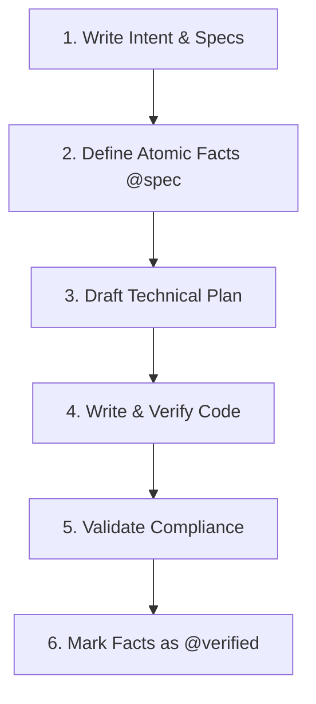

# Fact-Spec Driven Development (F-SDD) Guide

Fact-Spec Driven Development (F-SDD), also known as the **FI-SDD (Facts, Intents, Specs, Plans, Traces) model**, is an engineering methodology designed to enforce absolute traceability, prevent architectural drift, and guarantee quality-driven feature completeness.

This document serves as the guide and reference for developers and AI agents working on **Project Atlas**.

---

## 1. The F-SDD File Structure

Every feature or core system module is documented as a cohesive bundle of 5 files within the `.specify/specs/` directory:

```
.specify/specs/
  ├── [module].facts        # 1. Atomic Facts & Lifecycle Tags
  ├── [module].intent.md    # 2. Business Intent & Goals
  ├── [module].spec.md      # 3. Functional Specifications
  ├── [module].plan.md      # 4. Technical Plan & Schemas
  └── [module].trace.md     # 5. Architecture Decisions & Traces
```

---

## 2. File-by-File Specification

### 1. Facts Sheet (`[module].facts`)
The `.facts` file acts as the semantic database of requirements. It uses flat, single-line, atomic assertions.
*   **Rules**:
    *   No nesting or markdown blocks allowed.
    *   Group facts under bracketed section headers representing domain modules.
    *   Define facts as: `ID: Statement. @tag1 @tag2`
    *   Use tags to manage states (`@draft`, `@spec`, `@verified`) and layers (`@db`, `@ui`, `@api`, `@security`).
*   **Example**:
    ```text
    [trend/scoring]
    F-001: System calculates Opportunity Score based on weighted metrics. @spec
    F-002: Ingested signals are stored in the content_opportunities PostgreSQL table. @spec @db
    ```

### 2. Business Intent (`[module].intent.md`)
The `.intent.md` file defines the high-level business goals, constraints, and success criteria. It establishes the *why* and the *boundaries* of a system module.
*   **Structure**:
    1.  **Goals**: High-level value propositions and target metrics.
    2.  **Constraints**: Technical, architectural, operational, or safety boundaries.
    3.  **Success Criteria**: Clear criteria for validating completion.

### 3. Feature Specification (`[module].spec.md`)
The `.spec.md` file bridges the high-level intent with direct implementation requirements. It translates facts into user-centric flows.
*   **Structure**:
    1.  **Overview & Goal**: The problem description.
    2.  **User Stories**: Standard role-action-value stories (`As a... I want to... So that...`).
    3.  **Functional Requirements**: Core requirements linked to Fact IDs.
    4.  **Edge Cases**: Error bounds, connection losses, validation issues.
    5.  **Acceptance Criteria**: Concrete criteria that must be verified.
*   **Traceability Requirement**: Every requirement in Section 3 and Section 4 must explicitly reference the Fact ID it satisfies (e.g., `...must validate user input boundaries. (F-001)`).

### 4. Technical Plan (`[module].plan.md`)
The `.plan.md` file is the technical blueprint. It dictates database schema modifications, architectural integrations, file modifications, and test plans before code execution begins.
*   **Structure**:
    1.  **System Architecture**: Visual flowcharts, API endpoints, or ASCII diagrams.
    2.  **Technical Decisions**: External libraries, state stores, and middleware.
    3.  **Database & Schema Changes**: Direct DDL SQL queries for tables, indexes, and migrations.
    4.  **File Structure**: Target files cataloged as `[NEW]`, `[MODIFY]`, or `[DELETE]`.
    5.  **Verification Plan**: Outlines Unit/Integration, visual (Storybook), and E2E (Playwright) test targets.

### 5. Execution Trace (`[module].trace.md`)
The `.trace.md` file acts as the audit log. It is maintained during coding and finalized post-testing to record the exact decisions and test outputs.
*   **Structure**:
    1.  **Key Architectural Decisions**: Rationale for design choices, compromises, or deviations.
    2.  **Code Review & Dependency Map**: The final set of created/modified files.
    3.  **Test & Verification Plan**: Verification commands and outputs showing 100% test coverage.

---

## 3. The F-SDD Lifecycle & Governance Rules

All development must abide by the core principles defined in the **Project Constitution**:



1.  **No Spec, No Code**: Writing or modifying source files without an approved `.spec.md` and `.plan.md` is strictly prohibited.
2.  **Fact-to-Checklist Traceability**: Every checkbox item in an implementation checklist (`task.md` or issues) must reference the corresponding Fact ID (e.g., `- [ ] Implement user signup controller (F-002)`).
3.  **Atomic Fact Rule**: Facts must remain flat and atomic. If a fact contains the word "and" or describes two distinct behaviors, split it into separate facts.
4.  **Verification Gate**: A feature is not complete until all associated facts have their tags modified from `@spec` or `@draft` to `@verified` in the `.facts` file, confirmed by a successful test run documented in the `.trace.md`.
